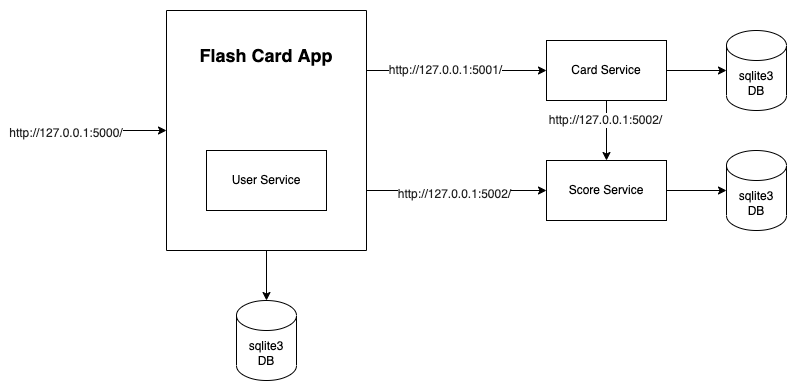
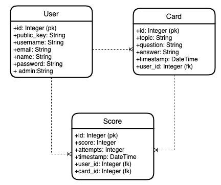

# Flash Card App

## Unzip the microservices before use

### Endpoint
> http://127.0.0.1:5000/

### User
> http://127.0.0.1:5000/user

### Card
> http://127.0.0.1:5001/card

### Score
> http://127.0.0.1:5002/score

### Test File
* test_api.py

#### Usage

> python test_api.py

#### Coverage

> coverage run -m unittest discover

> coverage run app/routes.py

> coverage report -m 

> coverage html

> coverage xml

## Architecture Diagram

## ER Diagram

## Usage

### virtual environment

* python3 -m pip install virtualenv 
* python3 -m virtualenv venv   
* source venv/bin/activate

### run app

* pip install -r requirements.txt
* sqlite3 user.db
* flask db init
* flask db migrate -m "create tables"
* flask db upgrade
#### Main App(User Service)
> flask run
#### Card Service
> flask run --port=5001 
#### Score Service
> flask run --port=5002

## References

* https://pythonhosted.org/Flask-JWT/
* https://www.sqlalchemy.org/
* https://www.sqlite.org/index.html
* https://microservices.io/
* https://docs.python-requests.org/en/latest/
* https://martinfowler.com/articles/microservices.html
* https://docs.python.org/3/library/unittest.html
* https://coverage.readthedocs.io/en/6.4/
